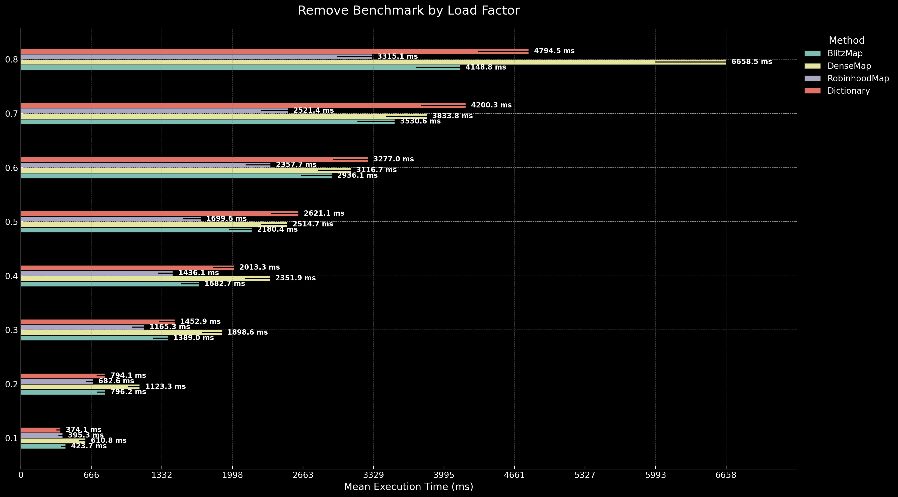

# Faster.Map

The goal of Faster.Map is to create a more efficient and performant alternative to the Dictionary and ConcurrentDictionary classes provided by .NET.
These standard collections are widely used for key-value pair storage in .NET applications, but they have certain limitations, particularly in high-performance and concurrent scenarios.

## Available Implementations:

* **DenseMap**: with SIMD Instructions:
        Harnesses SIMD (Single Instruction, Multiple Data) instructions for parallel processing, resulting in accelerated lookup times.
        Ideal for scenarios demanding high throughput and optimal CPU utilization.
* **RobinHoodMap**: with Linear Probing:
        Employs linear probing to resolve hash collisions, reducing the likelihood of clustering and improving access speed.
        Suitable for applications where a balance between performance and simplicity is required. 
* **CMap**:  is a high-performance, thread-safe, lockfree concurrent hashmap that uses open addressing, quadratic probing, and Fibonacci hashing to manage key-value 
        pairs. The default load factor is set to 0.5, meaning the hash map will resize when it is half full. Note: this hashmap will only allocate once while 
        resizing.
* **BlitzMap**: Fast and Efficient Open Addressing Flat HashMap – Utilizes a linked bucket approach, similar to separate chaining, for effective collision 
        management. This prevents severe slowdowns caused by primary and secondary clustering, ensuring stable and consistent performance even under high load 
        factors.


# Installation:

You can include Faster.Map in your C# project via NuGet Package Manager:
```
Install-Package Faster.Map
```

## Basic Usage

```csharp
var map = new DenseMap<int, string>();
map.Emplace(1, "Value One");
map.Emplace(2, "Value Two");

if (map.Get(1, out var value))
{
    Console.WriteLine($"Key 1 has value: {value}");
}

map.Remove(1);
```

 ## Tested on platforms:
* x86
* x64
* arm
* arm64

## Benchmark

``` ini
BenchmarkDotNet v0.13.12, Windows 11 (10.0.22631.3880/23H2/2023Update/SunValley3)
12th Gen Intel Core i5-12500H, 1 CPU, 16 logical and 12 physical cores
.NET SDK 9.0.100-preview.2.24157.14
  [Host]     : .NET 9.0.0 (9.0.24.12805), X64 RyuJIT AVX2
  DefaultJob : .NET 9.0.0 (9.0.24.12805), X64 RyuJIT AVX2
```

#  📊 **Get Benchmark**

This benchmark highlights how different hash map designs respond to increasing load factors when performing GET operations on a large dataset of 134,217,728 entries. The results align with each map's strengths and weaknesses:  

## 🔍 **Key Findings**
- **🏆 BlitzMap**: The most consistent performer, thanks to its proper mixing function, ensuring stable performance across all load factors.
- **🚀 DenseMap**: Starts slower due to SIMD overhead but shines at high load factors, leveraging vectorized lookups to handle dense datasets efficiently.
- **⚠️ RobinhoodMap**: Performs well at low load factors but **collapses beyond 0.5**, suffering extreme slowdowns due to poor collision handling.
- **🔻 Dictionary**: Uses identity hashing, leading to excessive collisions as the table fills, causing poor scalability at higher load factors.

## **Chart: Get Benchmark**


## 📌 **Conclusion**
For balanced performance across all conditions, **BlitzMap** is the best choice. However, **DenseMap** is highly effective in high-density scenarios where SIMD optimizations can be fully utilized.

# 📊 **Insert Benchmark**

The **"Insert Benchmark"** evaluates the performance of four data structures—**BlitzMap**, **DenseMap**, **RobinhoodMap**, and **Dictionary**—under varying load factors. The benchmark measures the time required to insert elements into a collection of **134,217,728** entries, focusing on how each method handles increased data density.

## **Chart: Insert Benchmark**


## 🔍 **Key Findings**
- **🏆 BlitzMap**: remains the best all-around choice**, offering **stable performance across all load factors**.
- **🚀 DenseMap**: is highly efficient for full tables**, but suffers from **overhead at lower load factors
- **⚠️ RobinhoodMap**: breaks down when the load factor exceeds 0.5**, making it **unreliable for high-density use cases
- **🔻 Dictionary**: struggles with excessive collisions**, making it **less scalable as the table fills

## 📌 **Conclusion**
For real-world applications requiring **consistent performance**, **BlitzMap is the safest choice**. If **high-density performance is the priority**, **DenseMap is the way to go**.

# 📊 **Update Benchmark**

The **"Update Benchmark"** evaluates the performance of four hash maps—**BlitzMap**, **DenseMap**, **RobinhoodMap**, and **Dictionary**—under varying load factors. The benchmark measures the time required to update elements in a dataset of **134,217,728** entries, identifying the fastest-performing implementations as load factors increase.

## **Chart: Update Benchmark**


## 🔍 **Key Findings**
- **⚡ RobinhoodMap is the fastest at lower load factors (0.1 - 0.4)**, achieving the **best update time of 197.1 ms at 0.1**.
- **🏆 BlitzMap takes over from 0.5 onward**, becoming the fastest at higher densities, thanks to its **effective mixing function**.
- **📉 RobinhoodMap collapses beyond 0.5**, as its **lack of a mixing function leads to severe clustering**, making updates significantly slower.
- **🚀 DenseMap and Dictionary struggle in all cases**, with **DenseMap suffering SIMD overhead at lower densities** and **Dictionary failing due to excessive collisions**.

## 📌 **Conclusion**
- **RobinhoodMap is the fastest at low load factors** but **fails beyond 0.5** due to excessive clustering.
- **BlitzMap becomes the best overall choice**, maintaining stable performance **even under high-density updates**.
- **DenseMap and Dictionary struggle across all load factors**, making them less suitable for frequent updates.

For **low-density updates, RobinhoodMap is best**, but for **high-density updates, BlitzMap is the clear winner**. 🚀

# 📊 **Remove Benchmark**

The **"Remove Benchmark"** evaluates the performance of four hash maps—**BlitzMap**, **DenseMap**, **RobinhoodMap**, and **Dictionary**—under varying load factors. This benchmark measures the time required to remove elements from a dataset of **134,217,728** entries, highlighting which implementations perform best as table density increases.

## **Chart: Remove Benchmark**



## 🔍 **Key Findings**
- **⚡ Fastest Overall:** **Dictionary is the fastest at low load factors (0.1), achieving 374.1 ms** due to minimal overhead in identity hashing.
- **🏆 Best Scalability:** **RobinhoodMap scales the best**, with only a **738% increase** from **0.1 to 0.8**, making it **the most efficient choice for high-density removals**.
- **🚨 Worst Scaling:** **DenseMap degrades the most**, increasing by **990%**, struggling with SIMD inefficiencies when removing elements.
- **❌ Slowest Overall:** **DenseMap at 0.8 (6,658.5 ms)**, as its vectorized lookups don't offer a significant advantage when handling removals.
- **🟢 BlitzMap remains a balanced choice**, increasing by **879%**, performing **better than DenseMap but worse than RobinhoodMap**.

## **🧐 Why is RobinhoodMap the Fastest at High Load Factors?**
- **RobinhoodMap's probe sequence naturally rebalances buckets**, making removals efficient even as the table fills up.
- **It avoids clustering issues that slow down Dictionary and DenseMap**, keeping operations smooth even at **high load factors**.
- **DenseMap struggles with SIMD overhead on removals**, making it **the worst performer at high densities**.

## 📌 **Conclusion**
- **For low load factors (0.1 - 0.2), Dictionary is the fastest**, offering the quickest removals due to its lightweight identity hashing.
- **For high load factors (0.4 - 0.8), RobinhoodMap is the best choice**, as its **probing strategy minimizes performance degradation**.
- **DenseMap suffers from major performance losses**, making it **the worst for large-scale removals**.
- **BlitzMap remains a solid alternative**, though it doesn't outperform RobinhoodMap in any category.
