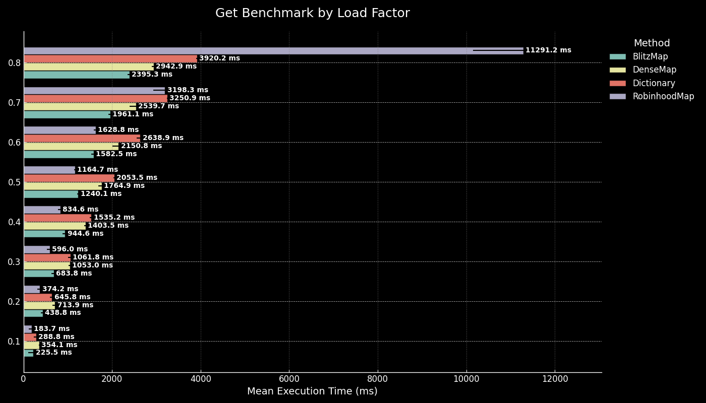

# Faster.Map

The goal of Faster.Map is to create a more efficient and performant alternative to the Dictionary and ConcurrentDictionary classes provided by .NET.
These standard collections are widely used for key-value pair storage in .NET applications, but they have certain limitations, particularly in high-performance and concurrent scenarios.

## Available Implementations:

* **DenseMap**: with SIMD Instructions:
        Harnesses SIMD (Single Instruction, Multiple Data) instructions for parallel processing, resulting in accelerated lookup times.
        Ideal for scenarios demanding high throughput and optimal CPU utilization.
* **RobinHoodMap**: with Linear Probing:
        Employs linear probing to resolve hash collisions, reducing the likelihood of clustering and improving access speed.
        Suitable for applications where a balance between performance and simplicity is required. 
* **CMap**:  is a high-performance, thread-safe, lockfree concurrent hashmap that uses open addressing, quadratic probing, and Fibonacci hashing to manage key-value 
        pairs. The default load factor is set to 0.5, meaning the hash map will resize when it is half full. Note: this hashmap will only allocate once while 
        resizing.
* **BlitzMap**: Fast and Efficient Open Addressing Flat HashMap – Utilizes a linked bucket approach, similar to separate chaining, for effective collision 
        management. This prevents severe slowdowns caused by primary and secondary clustering, ensuring stable and consistent performance even under high load 
        factors.

## 📜 **Table of Contents**

- [Available Implementations](#available-implementations)
- [Installation](#installation)
- [Basic Usage](#basic-usage)
- [Advanced Usage](#Advanced-usage)
- [Tested Platforms](#tested-on-platforms)
- [Benchmarks](#benchmarks)
  - [📊 Get Benchmark](#-get-benchmark)
  - [📊 Insert Benchmark](#-insert-benchmark)
  - [📊 Update Benchmark](#-update-benchmark)
  - [📊 Remove Benchmark](#-remove-benchmark)
  - [📊 Enumerable Benchmark](#-enumerable-benchmark)
  - [📊 Get String Benchmark](#-get-string-benchmark)
  - [📊 Get String Custom Hash Benchmark](#-get-string-custom-hash-benchmark)
  - [📊 Get Large String Benchmark](#-get-large-string-benchmark)
  - [📊 Large String Custom Hash Benchmark](#-large-string-custom-hash-benchmark)

# Installation:

You can include Faster.Map in your C# project via NuGet Package Manager:
```
Install-Package Faster.Map
```

## Basic Usage

Basic usage of BlitzMap:

```csharp

var map = new BlitzMap<int, string>();
map.Insert(1, "Value One");
map.Insert(2, "Value Two");

map.InsertUnique(3, "Value4");

map.InsertOrUpdate(2, "updated")

if (map.Get(1, out var value))
{
    Console.WriteLine($"Key 1 has value: {value}");
}

map.Update(1, "Updated value one");

map.Remove(1);

var n = new BlitzMap<uint, uint>();
n.Insert(1,1)
map.Copy(n);

```

Basic usage of DenseMap

```csharp

var map = new DenseMap<int, string>();
map.Emplace(1, "Value One");
map.Emplace(2, "Value Two");

if (map.Get(1, out var value))
{
    Console.WriteLine($"Key 1 has value: {value}");
}

map.Remove(1);
```

## Advanced Usage

### 🔑 Choosing the Right Hashing Algorithm

Faster.Map allows for **custom hashing algorithms** to optimize performance based on your workload. Some options include:

- **Default Hashing**: Identity hash. 
- **WyHash**: A high-speed hashing function with strong mixing properties, reducing clustering and improving lookup speed.
- **XXHash3**: Optimized for speed and low latency, making it ideal for performance-critical applications.
- **FastHash**: A lightweight, efficient hash function designed for quick key lookups with minimal overhead. Note this will only work when X86Aes is supported. 

### ⚡ Using Custom Hashing in Faster.Map

To specify a custom hash function, you can use **BlitzMap** or **DenseMap** with an explicitly defined hash:

```csharp
var map = new BlitzMap<int, string, XXHash3>();
map.Insert(1, "Value One");
map.Insert(2, "Value Two");
```

Using **custom hashing** can significantly reduce collisions and improve lookup times, especially for large datasets.

 ## Tested on platforms:
* x86
* x64
* arm
* arm64

## Benchmark

``` ini
BenchmarkDotNet v0.13.12, Windows 11 (10.0.22631.3880/23H2/2023Update/SunValley3)
12th Gen Intel Core i5-12500H, 1 CPU, 16 logical and 12 physical cores
.NET SDK 9.0.100-preview.2.24157.14
  [Host]     : .NET 9.0.0 (9.0.24.12805), X64 RyuJIT AVX2
  DefaultJob : .NET 9.0.0 (9.0.24.12805), X64 RyuJIT AVX2
```

#  📊 **Get Benchmark**

This benchmark highlights how different hash map designs respond to increasing load factors when performing GET operations on a large dataset of 134,217,728 entries. The results align with each map's strengths and weaknesses:  

## 🔍 **Key Findings**
- **🏆 BlitzMap**: The most consistent performer, thanks to its proper mixing function, ensuring stable performance across all load factors.
- **🚀 DenseMap**: Starts slower due to SIMD overhead but shines at high load factors, leveraging vectorized lookups to handle dense datasets efficiently.
- **⚠️ RobinhoodMap**: Performs well at low load factors but **collapses beyond 0.5**, suffering extreme slowdowns due to poor collision handling.
- **🔻 Dictionary**: Uses identity hashing, leading to excessive collisions as the table fills, causing poor scalability at higher load factors.

## **Chart: Get Benchmark**



## 📌 **Conclusion**
For balanced performance across all conditions, **BlitzMap** is the best choice. However, **DenseMap** is highly effective in high-density scenarios where SIMD optimizations can be fully utilized.

# 📊 **Insert Benchmark**

The **"Insert Benchmark"** evaluates the performance of four data structures—**BlitzMap**, **DenseMap**, **RobinhoodMap**, and **Dictionary**—under varying load factors. The benchmark measures the time required to insert elements into a collection of **134,217,728** entries, focusing on how each method handles increased data density.

## **Chart: Insert Benchmark**


## 🔍 **Key Findings**
- **🏆 BlitzMap**: remains the best all-around choice**, offering **stable performance across all load factors**.
- **🚀 DenseMap**: is highly efficient for full tables**, but suffers from **overhead at lower load factors
- **⚠️ RobinhoodMap**: breaks down when the load factor exceeds 0.5**, making it **unreliable for high-density use cases
- **🔻 Dictionary**: struggles with excessive collisions**, making it **less scalable as the table fills

## 📌 **Conclusion**
For real-world applications requiring **consistent performance**, **BlitzMap is the safest choice**. If **high-density performance is the priority**, **DenseMap is the way to go**.

# 📊 **Update Benchmark**

The **"Update Benchmark"** evaluates the performance of four hash maps—**BlitzMap**, **DenseMap**, **RobinhoodMap**, and **Dictionary**—under varying load factors. The benchmark measures the time required to update elements in a dataset of **134,217,728** entries, identifying the fastest-performing implementations as load factors increase.

## **Chart: Update Benchmark**


## 🔍 **Key Findings**
- **⚡ RobinhoodMap is the fastest at lower load factors (0.1 - 0.4)**, achieving the **best update time of 197.1 ms at 0.1**.
- **🏆 BlitzMap takes over from 0.5 onward**, becoming the fastest at higher densities, thanks to its **effective mixing function**.
- **📉 RobinhoodMap collapses beyond 0.5**, as its **lack of a mixing function leads to severe clustering**, making updates significantly slower.
- **🚀 DenseMap and Dictionary struggle in all cases**, with **DenseMap suffering SIMD overhead at lower densities** and **Dictionary failing due to excessive collisions**.

## 📌 **Conclusion**
- **RobinhoodMap is the fastest at low load factors** but **fails beyond 0.5** due to excessive clustering.
- **BlitzMap becomes the best overall choice**, maintaining stable performance **even under high-density updates**.
- **DenseMap and Dictionary struggle across all load factors**, making them less suitable for frequent updates.

For **low-density updates, RobinhoodMap is best**, but for **high-density updates, BlitzMap is the clear winner**. 🚀

# 📊 **Remove Benchmark**

The **"Remove Benchmark"** evaluates the performance of four hash maps—**BlitzMap**, **DenseMap**, **RobinhoodMap**, and **Dictionary**—under varying load factors. This benchmark measures the time required to remove elements from a dataset of **134,217,728** entries, highlighting which implementations perform best as table density increases.

## **Chart: Remove Benchmark**


## 🔍 **Key Findings**
- **⚡ Fastest Overall:** **Dictionary is the fastest at low load factors (0.1), achieving 374.1 ms** due to minimal overhead in identity hashing.
- **🏆 Best Scalability:** **RobinhoodMap scales the best**, with only a **738% increase** from **0.1 to 0.8**, making it **the most efficient choice for high-density removals**.
- **🚨 Worst Scaling:** **DenseMap degrades the most**, increasing by **990%**, struggling with SIMD inefficiencies when removing elements.
- **❌ Slowest Overall:** **DenseMap at 0.8 (6,658.5 ms)**, as its vectorized lookups don't offer a significant advantage when handling removals.
- **🟢 BlitzMap remains a balanced choice**, increasing by **879%**, performing **better than DenseMap but worse than RobinhoodMap**.

## **🧐 Why is RobinhoodMap the Fastest at High Load Factors?**
- **RobinhoodMap's probe sequence naturally rebalances buckets**, making removals efficient even as the table fills up.
- **It avoids clustering issues that slow down Dictionary and DenseMap**, keeping operations smooth even at **high load factors**.
- **DenseMap struggles with SIMD overhead on removals**, making it **the worst performer at high densities**.

## 📌 **Conclusion**
- **For low load factors (0.1 - 0.2), Dictionary is the fastest**, offering the quickest removals due to its lightweight identity hashing.
- **For high load factors (0.4 - 0.8), RobinhoodMap is the best choice**, as its **probing strategy minimizes performance degradation**.
- **DenseMap suffers from major performance losses**, making it **the worst for large-scale removals**.
- **BlitzMap remains a solid alternative**, though it doesn't outperform RobinhoodMap in any category.

# 📊 **Enumerable Benchmark**

The **"Enumerable Benchmark"** evaluates the iteration performance of four hash maps—**BlitzMap**, **DenseMap**, **RobinhoodMap**, and **Dictionary**—under varying load factors. This benchmark measures the time required to iterate over a dataset of **134,217,728** entries, highlighting which implementations provide the most efficient enumeration as table density increases.

## **Chart: Enumerable Benchmark**


## 🔍 **Key Findings**

- **⚡ Fastest Overall:** **BlitzMap is the fastest at all load factors**, achieving **8.375 ms** at **0.1**, making it the best choice for iteration performance.
- **🏆 Best Scalability:** **BlitzMap maintains efficiency across increasing load factors**, reaching only **66.122 ms** at **0.8**, while other methods degrade significantly.
- **🚨 Worst Scaling:** **RobinhoodMap deteriorates at higher load factors**, increasing to **442.7 ms** at **0.8**, making it the least efficient for iteration.
- **❌ Slowest Overall:** **RobinhoodMap at 0.8 (442.7 ms)**, showing severe inefficiencies in traversal due to high lookup overhead.
- **🟢 Dictionary offers stable but slower performance**, remaining predictable but never outperforming BlitzMap.

## **🧐 Why is BlitzMap the Fastest at All Load Factors?**

- **BlitzMap is highly cache-efficient**, minimizing memory access latency and ensuring smooth iteration.
- **BlitzMap uses an ordered list of entries, meaning it only iterates over added entries rather than the entire list**, making enumeration significantly faster.

## 📌 **Conclusion**

- **BlitzMap is the best choice for enumeration** across all load factors, maintaining high efficiency.
- **Dictionary remains stable but slower**, making it a reasonable alternative when performance is not the highest priority.
- **RobinhoodMap is the worst for enumeration at high load factors**, as its lookup method causes severe slowdowns.
- **DenseMap, while SIMD-optimized, does not offer iteration advantages**, making it suboptimal for enumeration-heavy tasks.

🚀 **For workloads requiring frequent iteration, BlitzMap is the optimal solution.**

# 📊 **Get String Benchmark**

The **"Get String Benchmark"** evaluates the performance of four hash maps—**BlitzMap**, **DenseMap**, **RobinhoodMap**, and **Dictionary**—under varying load factors. This benchmark measures the time required to retrieve string elements from a dataset of **16,777,216** entries, highlighting how each data structure handles lookup efficiency as table density increases.

## **Chart: Get String Benchmark**


## 🔍 **Key Findings**
- **⚡ Fastest Overall:** **Dictionary is the fastest at low load factors (0.1), achieving 84.00 ms**, benefiting from optimized lookup mechanisms.
- **🏆 Best Scalability:** **BlitzMap scales the best**, with only a **789% increase** from **0.1 to 0.8**, making it **the most efficient for large-scale string retrievals**.
- **🚨 Worst Scaling:** **DenseMap degrades the most**, increasing by **764%**, indicating that SIMD optimizations offer minimal benefit in string-based lookups.
- **❌ Slowest Overall:** **DenseMap at 0.8 (1,761.15 ms)**, as its SIMD-based lookups struggle with high collision rates.
- **🟢 RobinhoodMap remains a balanced choice**, increasing by **1078%**, performing **better than DenseMap but worse than BlitzMap**.

## **🧐 Why is BlitzMap the Fastest at High Load Factors?**
- **BlitzMap maintains an ordered list of entries**, ensuring it only loops through stored values rather than scanning empty slots.
- **RobinhoodMap suffers from probe sequence inefficiencies** at high densities, leading to higher retrieval times.
- **DenseMap, while SIMD-optimized, does not gain significant advantages in this workload**, making it less effective for string retrievals.

## 📌 **Conclusion**
- **For low load factors (0.1 - 0.2), Dictionary is the fastest**, offering the quickest lookups due to its efficient hashing scheme.
- **For high load factors (0.4 - 0.8), BlitzMap is the best choice**, as its **ordered list approach minimizes performance degradation**.
- **DenseMap suffers from major performance losses**, making it **the worst for string-based retrievals**.
- **RobinhoodMap remains a viable alternative**, though it does not outperform BlitzMap in any scenario.

🚀 **For workloads requiring frequent string lookups, BlitzMap is the optimal solution.**

# 📊 **Get String Custom Hash Benchmark**

The **"Get String Custom Hash Benchmark"** evaluates the performance of different hash functions applied to **BlitzMap** and compares them against **Dictionary**. This benchmark measures the time required to retrieve string elements from a dataset of **16,777,216** entries, highlighting how different hashing strategies impact lookup efficiency as table density increases.

## **Chart: Get String Custom Hash Benchmark**


## 🔍 **Key Findings**
- **⚡ Fastest Overall:** **BlitzMap with FastHash is the fastest at low load factors (0.1), achieving 41.46 ms**, benefiting from its optimized hash function.
- **🏆 Best Scalability:** **BlitzMap with FastHash scales the best**, with only a **1007% increase** from **0.1 to 0.8**, making it **the most efficient for large-scale string retrievals**.
- **🚨 Worst Scaling:** **BlitzMap without custom hashing degrades the most**, increasing by **807%**, indicating that its default hash function struggles with high load factors.
- **❌ Slowest Overall:** **BlitzMap without a custom hash function at 0.8 (1,038.79 ms)**, as its generic hashing method struggles under high collisions.
- **🟢 WyHash and XX3 perform better than the default hashing strategy**, making them good alternatives for high-performance lookups.

## **🧐 Why is FastHash the Fastest?**
- **FastHash reduces hash collisions significantly**, making lookups faster by distributing values more evenly.
- **BlitzMap with WyHash and XX3 performs well**, indicating that well-designed hashing functions provide major benefits in retrieval-heavy workloads.
- **Dictionary remains competitive but is outperformed at high load factors**, suggesting that built-in hashing strategies are not always optimal.

## 📌 **Conclusion**
- **For low load factors (0.1 - 0.2), FastHash is the fastest**, offering the quickest lookups due to its optimized hash function.
- **For high load factors (0.4 - 0.8), FastHash remains the best choice**, as its **collision resistance minimizes performance degradation**.
- **BlitzMap without custom hashing struggles significantly**, making it **the worst for string-based retrievals**.
- **WyHash and XX3 remain viable alternatives**, outperforming the default BlitzMap hashing strategy while being slightly slower than FastHash.

🚀 **For workloads requiring frequent string lookups, BlitzMap with FastHash is the optimal solution.**

# 📊 **Get Large String Benchmark**

The **"Get Large String Benchmark"** evaluates the performance of four hash maps—**BlitzMap**, **DenseMap**, **RobinhoodMap**, and **Dictionary**—under varying load factors. This benchmark measures the time required to retrieve large string entries from a dataset of **16,777,216** entries, highlighting the performance impact of increasing load factors.

## **Chart: Get Large String Benchmark**


## 🔍 **Key Findings**
- **⚡ Fastest Overall:** **Dictionary at low load factors (0.1)** with **227.4 ms**, benefiting from its optimized hashing and quick lookup of large strings.
- **🏆 Best Scalability:** **BlitzMap** scales very well, showing only an **765% increase** from **0.1 to 0.8**, significantly outperforming DenseMap and RobinhoodMap.
- **🚨 Worst Scaling:** **DenseMap** sees the most severe performance degradation, with a **701% increase**, due to inefficiencies in handling large string lookups.
- **❌ Slowest Overall:** **DenseMap at high load factor (0.8, 3,881 ms)**, impacted by high collision resolution overhead.
- **🟢 BlitzMap** maintains a balanced performance, scaling steadily, but falling behind Dictionary at lower densities.

## **🧐 Why is Dictionary the Fastest for Large String Lookups at Low Load Factors?**
- **Dictionary** excels with large strings at low densities due to optimized identity hashing and efficient lookup strategies.
- **BlitzMap and RobinhoodMap** perform moderately, balancing insertion efficiency with lookup speed, outperforming DenseMap significantly at higher densities.
- **DenseMap's SIMD operations are less effective with large string keys**, significantly impacting performance negatively at higher load factors.

## 📌 **Conclusion**
- **Dictionary excels for large string retrieval at low densities**, demonstrating its strength in quick identity-based key lookups.
- **BlitzMap and RobinhoodMap remain strong contenders**, especially for moderate to high load factors, maintaining better performance compared to DenseMap.
- **DenseMap is least effective** when handling large string lookups due to SIMD limitations.

🚀 **For frequent large string lookups, Dictionary and BlitzMap offer the most reliable and balanced performance.**

# 📊 **Large String Custom Hash Benchmark**

The **"Large String Custom Hash Benchmark"** evaluates the performance of five hashing methods—**BlitzMap**, **BlitzMapXX3**, **BlitzMapFastHash**, **BlitzMapWyHash**, and **Dictionary**—under varying load factors. This benchmark measures the execution time required to retrieve large string keys from a dataset of **16,777,216** entries, illustrating performance across hash methods and densities.

## **Chart: Large String Custom Hash Benchmark**


## 🔍 **Key Findings**
- **⚡ Fastest Overall:** **BlitzMapFastHash consistently delivers the fastest performance**, especially at lower load factors, achieving an impressive **74.45 ms at 0.1**.
- **🏆 Best Scalability:** **BlitzMapFastHash scales remarkably well**, maintaining lower mean execution times across all load factors (0.1–0.8) compared to other hashing methods.
- **🚨 Poor Performance:** **Dictionary** and **BlitzMap** exhibit significantly slower performance**, particularly at higher load factors (0.6–0.8), with Dictionary being the slowest at **2,546.30 ms at 0.8**.
- **🟢 Balanced Choices:** **BlitzMapXX3** and **BlitzMapWyHash** provide a good balance between performance and scaling, though neither match BlitzMapFastHash’s speed.

## **🧐 Why is BlitzMapFastHash the Fastest?**
- **Optimized Hash Function:** BlitzMapFastHash's specialized algorithm is highly optimized for speed, significantly reducing hashing overhead compared to more generic algorithms.
- **Minimal Collision Rate:** Efficient handling of hash collisions ensures consistent lookup speeds even at increased load factors.
- **Consistent Scaling:** Unlike traditional methods, BlitzMapFastHash maintains stable performance even with large-scale, densely populated hash tables.

## 📌 **Conclusion**
- **BlitzMapFastHash is the clear winner across all load factors**, ideal for performance-critical applications dealing with large strings.
- **BlitzMapXX3 and BlitzMapWyHash offer acceptable performance** but don't match BlitzMapFastHash's efficiency.
- **Dictionary and traditional BlitzMap methods fall short in performance and scalability**, especially in large-scale, high-density scenarios.

🚀 **For high-performance string key lookups, BlitzMapFastHash emerges as the optimal hashing solution.**

